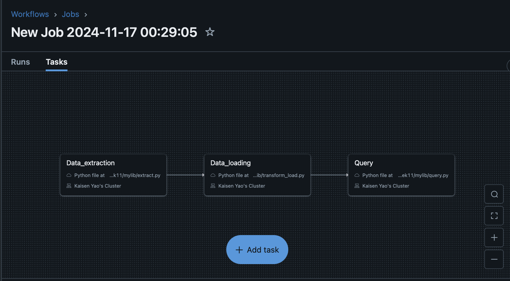
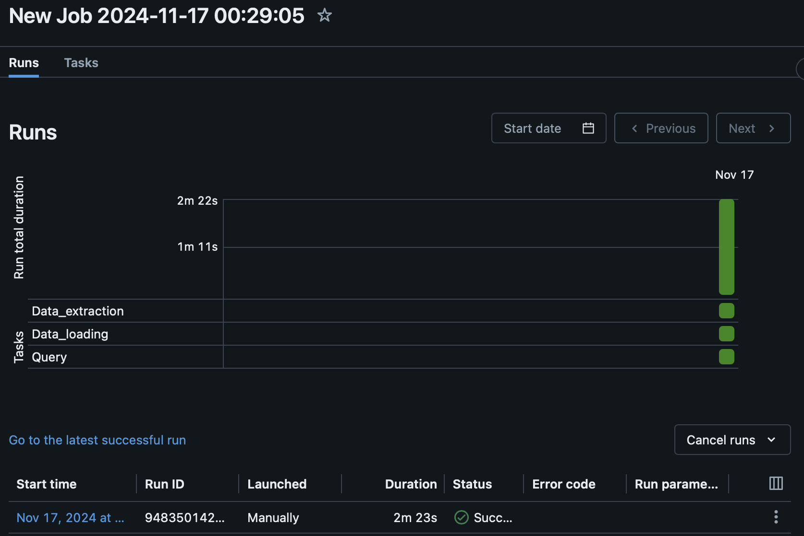
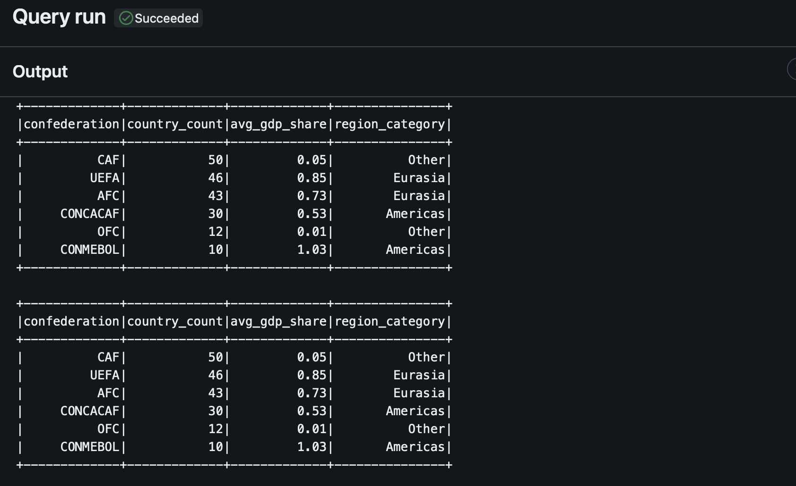

# Kaisen Yao IDS 706 Week 10 - FIFA Data Pipeline with Databricks

[](https://github.com/nogibjj/Kaisen_Yao_IDS706_Week11/actions/workflows/cicd.yml)

## Overview

This project implements an automated data pipeline using Databricks to process and analyze FIFA country data. The pipeline leverages Databricks' distributed computing platform to perform data extraction, transformation, and complex analysis of global FIFA statistics and metrics.

## Dataset

The pipeline processes data from FiveThirtyEight's "How To Break FIFA" story. The primary dataset fifa_countries_audience.csv (http://fivethirtyeight.com/features/how-to-break-fifa/) contains key metrics about FIFA member countries and their global influence:

Header | Definition
---|---------
`country` | FIFA member country
`confederation` | Confederation to which country belongs
`population_share` | Country's share of global population (percentage)
`tv_audience_share` | Country's share of global world cup TV Audience (percentage)
`gdp_weighted_share` | Country's GDP-weighted audience share (percentage)

## Architecture

The pipeline consists of three main components:

1. **Data Extraction** (`extract.py`)
   - Downloads compressed data files
   - Extracts CSV data
   - Stores extracted data in Databricks FileStore

2. **Data Transformation** (`transform_load.py`)
   - Converts CSV files to Spark DataFrames
   - Performs data cleaning and validation
   - Loads data into Delta Lake tables

3. **Data Analysis** (`query.py`)
   - Implements PySpark queries and transformations including:
     - Confederation statistics:
       - Country count by confederation
       - Average GDP-weighted share analysis
     - Regional categorization:
       - Grouping confederations into major regions (Eurasia, Americas, Other)
       - Custom transformation logic for regional analysis
     - Data aggregation:
       - Grouping and summarizing by confederation
       - Sorting and ranking analysis
     - Complex transformations:
       - Conditional column creation
       - Multi-condition data categorization

## Setup Instructions

### Prerequisites

- Azure account with Databricks access
- Python 3.8+
- Make utility
- Git

### Environment Configuration

1. Set up the following environment variables:
   ```
   ACCESS_TOKEN=<your-databricks-access-token>
   SERVER_HOSTNAME=<your-databricks-server>
   REPO_ID=<your-databricks-repo-id>
   JOB_ID=<your-databricks-job-id>
   ```

2. Store these variables in:
   - Local `.env` file for development
   - GitHub Secrets for CI/CD

### Development Workflow

Run these commands as needed:

```bash
make format        # Format code using black
make lint         # Run linting checks
make sync_repo    # Update Databricks repository
make run_job      # Execute Databricks pipeline
```

## Pipeline Automation

### Databricks Integration

The pipeline is configured as a Databricks job with the following workflow:



### Continuous Integration

The `.github/workflows/cicd.yml` workflow automates:

1. Code quality checks
2. Databricks repository synchronization
3. Pipeline execution

### Monitoring

Pipeline execution can be monitored through:

1. GitHub Actions dashboard
   

2. Databricks console
   

## Key Components

### `sync_databricks.py`
- Manages repository synchronization with Databricks
- Utilizes Databricks REST API
- Ensures latest code deployment

### `main.py`
- Orchestrates pipeline execution
- Handles job triggering and monitoring
- Provides execution status updates

## Development

### Contributing

1. Fork the repository
2. Create a feature branch
3. Implement changes
4. Submit a pull request

### Code Style

This project follows:
- PEP 8 for Python code style
- Black for code formatting
- Pylint for code quality

### References
1. [Python Ruff Template](https://github.com/nogibjj/python-ruff-template)
2. [FiveThirtyEight FIFA Dataset](https://github.com/fivethirtyeight/data/blob/master/fifa)
3. [PySpark Documentation](https://spark.apache.org/docs/latest/api/python/index.html)